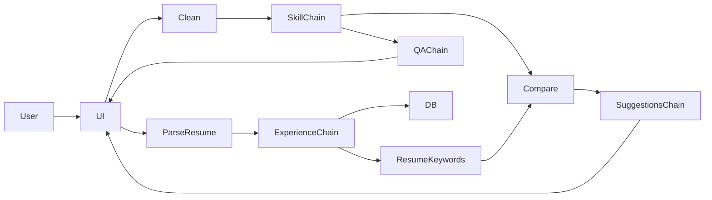

# Interview Companion Agent

A Streamlit web application that extracts technical skills from job descriptions (JDs), parses resumes to extract professional experience and keywords, identifies missing keywords, and generates interview questions and resume improvement suggestions using Google Gemini via LangChain.

---

## Features

- Extract technologies, tools, programming languages, frameworks and skills from a job description.
- Clean and normalize JD text (remove digits, emojis, hashtags, punctuation).
- Parse uploaded resumes (PDF / DOCX) and extract the professional experience section.
- Extract keywords from resume experience and detect missing JD skills.
- Generate resume bullet-point suggestions to incorporate missing skills.
- Generate interview questions and detailed answers for each extracted skill.
- Persist parsed resume experience to a local SQLite database (`resumes.db`).

Notes:
- The skill extraction and QA generation are powered by LangChain prompt templates and the Google Gemini model; outputs depend on the prompts and model behavior.
- The app is intended for technical hiring preparation and resume improvement — do not rely on it for legal or medical advice.

---

## Architecture



Design notes:
- LangChain is used to compose prompt templates, output parsers, and chains; the model call is centralized in `model = ChatGoogleGenerativeAI(...)`.
- The Streamlit UI orchestrates user inputs and displays outputs; long-running steps use `st.spinner` to indicate progress.

---

## Repository structure

- `src/app.py` — Streamlit app entrypoint (UI, orchestration, DB storage).
- `src/JD_extracter.py` — older/experimental utilities for JD extraction and examples.
- `requirements.txt` — Python dependencies used by the project.
- `resumes.db` — local SQLite database (stores parsed experience per user id).
- `.env` — local environment variables (API keys). This file is ignored by git.
- `.gitignore` — ignores `.env`, virtual environments and other artifacts.

---

## Quick start (Windows PowerShell)

1. Create and activate a virtual environment

```powershell
python -m venv myenv
.\myenv\Scripts\Activate.ps1
```

2. Install dependencies

```powershell
pip install --upgrade pip
pip install -r requirements.txt
```

3. Add API key(s) to `.env` in the repository root

```
API_KEY=your_google_gemini_api_key_here
```

4. Run the Streamlit app

```powershell
streamlit run src/app.py
```

Open the local URL that Streamlit prints in the terminal.

Tips:
- If `pip` complains about a broken environment, recreate `myenv` (delete and run `python -m venv` again).
- Use `pip install streamlit` if you want only the UI dependencies for quick testing.

---

## Usage examples

Sample JD input:
```
AI/ML Engineer (GenAI)
Location: Austin, TX (Onsite)
Skills: Python, AWS, Data science, Machine Learning, Gen AI
10+ Yrs
```

Expected cleaned JD (example):
```
ai ml engineer genai python aws data science machine learning gen ai
```

Typical outputs shown in the UI:
- Extracted skills: `Python, AWS, Data science, Machine Learning, Gen AI`
- Generated interview Q&A for each skill (2 questions each)
- Resume improvement suggestions (2-3 bullet points per missing skill)

---

## Pipeline details

1. `clean_jd()` normalization:
   - Lowercase, remove digits and plus signs, remove hashtags and emojis, strip punctuation, collapse spaces.
2. Skill extraction chain:
   - Uses a prompt template and `CommaSeparatedListOutputParser` to obtain a list of skills.
3. Resume parsing:
   - PDF resumes use `PyPDFLoader` (from `langchain_community`), DOCX uses `python-docx`.
4. Experience extraction:
   - A dedicated prompt extracts the professional experience section as a single string.
5. Resume keyword extraction:
   - The experience text is fed to another chain that returns comma-separated technical keywords.
6. Missing keyword detection:
   - Simple set difference between JD skills and resume keywords (case-insensitive).
7. Resume suggestion generation:
   - For each missing skill, a prompt generates 2-3 realistic bullet points to add to the resume.
8. QA generation:
   - Produces 2 interview questions and detailed answers per skill; outputs parsed via `JsonOutputParser`.

Limitations & caveats:
- The model can hallucinate or return noisy output; validate generated suggestions before use.
- Keyword matching is naive: exact word matches only; consider stemming or fuzzy matching to improve recall.
- Large resumes may exceed prompt/token limits; consider chunking long texts.

---


